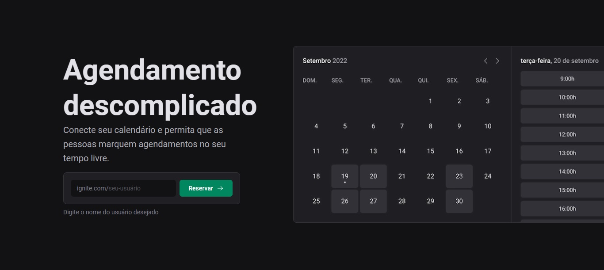

# Ignite Call

This is a FullStack project integrated with Google Calendar to create schedules.

Developed with `NextJS`, `Typescript`, `Stitches`, `Prisma` and `MySQL`.

**Features:**
- Google APIs
- Next Auth
- SSR

<p align=center>
  
</p>

## 💻 How to run the project

### Install the Dependencies

```
npm install
```

### Google API config
* Create a new project in [Google Cloud](https://console.cloud.google.com/welcome)
* Go to **APIs and services**
* Go to **OAuth permission** and configure your project
* Go to **Credentials** > **OAuth client id** and create your keys
* Save the **GOOGLE_CLIENT_ID** and **GOOGLE_CLIENT_SECRET** in your `.env` file
* To create your **NEXTAUTH_SECRET** follow the instructions in [Next Auth Documentation](https://next-auth.js.org/configuration/options#secret)
* Create a MySql data base, save the **DATABASE_URL** and run in your preferred server

```title:Env
# MySQL Database
DATABASE_URL=

# Google OAuth
GOOGLE_CLIENT_ID=
GOOGLE_CLIENT_SECRET=
NEXTAUTH_SECRET=
```


### Run the Web Application

```
npm run dev
```

<h4 align=center>Developed by <a href="https://www.linkedin.com/in/guirdy/">Guilherme Leandro</a> 💻</h4>

